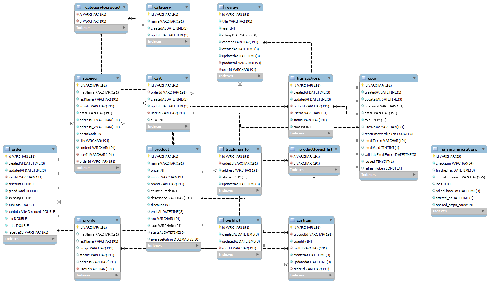

# Talga-Ecommerce-API

A REST API for online e-commerce system

## Features:

- Token based Authentication and Authorization
- Handling of anonymous costumer
- Boarding of anonymous user to registered user
- Scalable Shopping cart - DB solution
- Refresh tokens for preventing unauthorized access by blocking compromised or invalid tokens.
- Products listing
- Product riviews
- Product wishlist
- Order placements
- Sending Email
- Payment
- File upload
- Custom Error Handling
- Full Text Search
- Database transactions
- Server Side pagination
- Server side schema validation.
- Admin portal
- API Rate Limiting
- Dependency injection
- Swagger

## Technology Stack:

- Node js
- Express Js
- MySQL
- Prisma

## Entity Relationship Diagram:



## Usage

"/.env" update the values/settings to your own

## Install Dependencies

```
npm install
```

## Run App

```
# Run in dev mode
npm start

```
